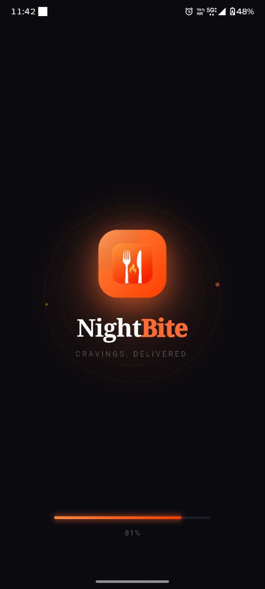
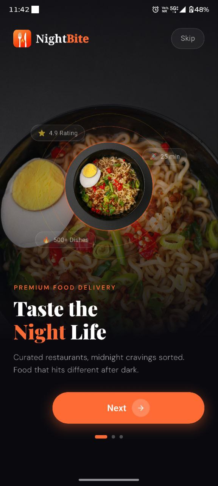
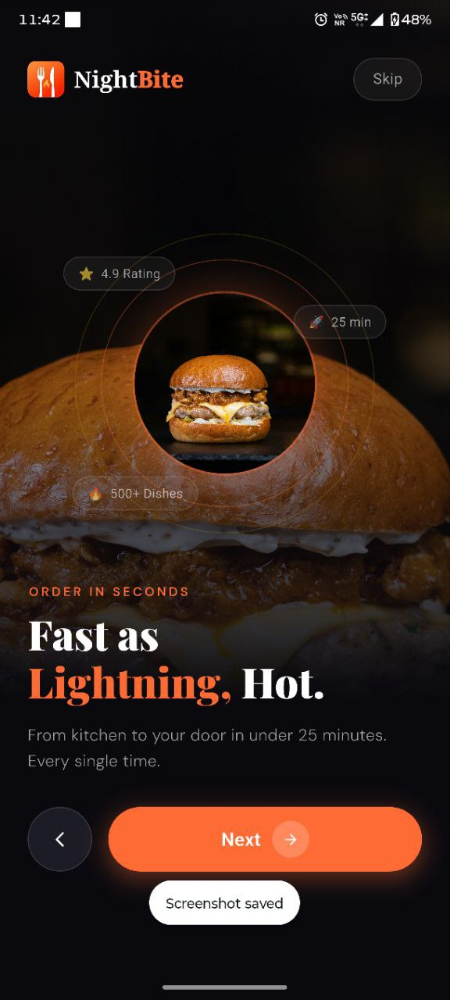
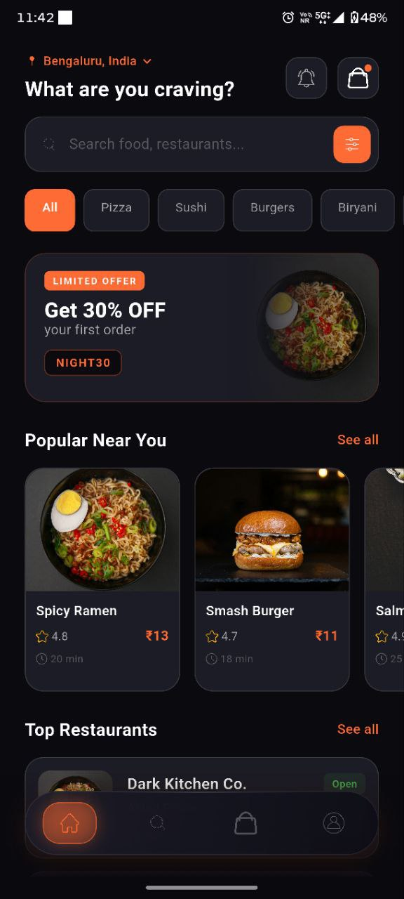
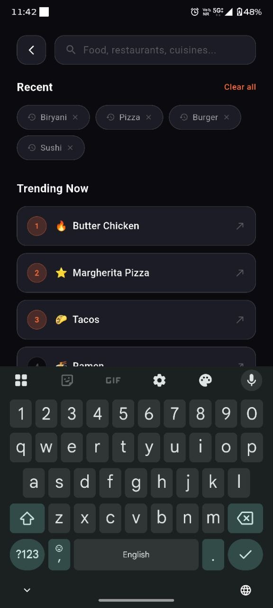
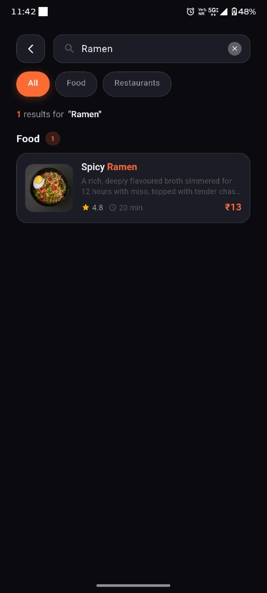

# 🍽️ Restaurant App

A modern Flutter-based restaurant application that allows users to **browse menus, place orders, and get food delivered directly from the restaurant**.

This project is built using **Vibe Coding with AI agents**, focusing on rapid development, clean UI, and efficient user experience.

---

## 🚀 Features

- 📱 Beautiful and responsive Flutter UI  
- 🍔 Browse food menu with images  
- 🛒 Add to cart & place orders  
- 🚚 Direct restaurant delivery system  
- ⚡ Fast and smooth performance  
- 🤖 Built using AI-assisted development (Vibe Coding)

---

## 🛠️ Tech Stack

- **Flutter** (UI Development)
- **Dart**
- **REST APIs / Backend Integration**
- **AI-assisted coding tools**

---

## 📸 App Screenshots

<p align="center">
  
  
  
</p>

<p align="center">
  
  
  
</p>

---

## 📦 Getting Started

1. Clone the repository  
```bash
git clone https://github.com/your-username/restaurant.git